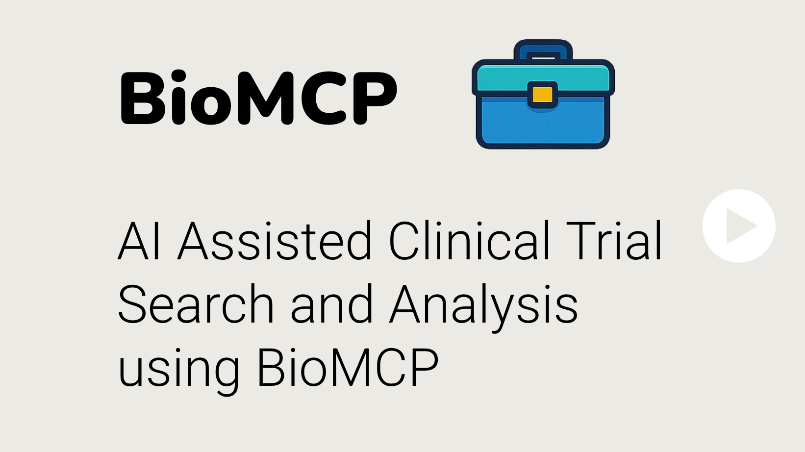

# AI-Assisted Clinical Trial Search: How BioMCP Transforms Research

Finding the right clinical trial for a research project has traditionally been
a complex process requiring specialized knowledge of database syntax and
medical terminology. BioMCP is changing this landscape by making clinical trial
data accessible through natural language conversation.

Video Link:

## Breaking Down the Barriers to Clinical Trial Information

BioMCP serves as a specialized Model Context Protocol (MCP) server that
empowers AI assistants and agents with tools to interact with critical
biomedical resources. For clinical trials specifically, BioMCP connects to the
ClinicalTrials.gov API, allowing researchers and clinicians to search and
retrieve trial information through simple conversational queries.

The power of this approach becomes apparent when we look at how it transforms a
complex search requirement. Imagine needing to find active clinical trials for
pembrolizumab (a cancer immunotherapy drug) specifically for non-small cell
lung carcinoma near Cleveland, Ohio. Traditionally, this would require:

1. Navigating to ClinicalTrials.gov
2. Understanding the proper search fields and syntax
3. Creating multiple filters for intervention (pembrolizumab), condition (
   non-small cell lung carcinoma), status (recruiting), and location (Cleveland
   area)
4. Interpreting the results

## From Natural Language to Precise Database Queries

With BioMCP, this entire process is streamlined into a simple natural language
request. The underlying large language model (LLM) interprets the query,
identifies the key entities (drug name, cancer type, location), and translates
these into the precise parameters needed for the ClinicalTrials.gov API.

The system returns relevant trials that match all criteria, presenting them in
an easy-to-understand format. But the interaction doesn't end there—BioMCP
maintains context throughout the conversation, enabling follow-up questions
like:

- Where exactly are these trials located and how far are they from downtown
  Cleveland?
- What biomarker eligibility criteria do these trials require?
- Are there exclusion criteria I should be aware of?

For each of these questions, BioMCP calls the appropriate tool (trial
locations, trial protocols) and processes the information to provide meaningful
answers without requiring the user to navigate different interfaces or learn
new query languages.

## Beyond Basic Search: Understanding Trial Details

What truly sets BioMCP apart is its ability to go beyond simple listings. When
asked about biomarker eligibility criteria, the system can extract this
information from the full trial protocol, synthesize it, and present a clear
summary of requirements. This capability transforms what would typically be
hours of reading dense clinical documentation into a conversational exchange
that delivers precisely what the researcher needs.

## Transforming Clinical Research Workflows

The implications for clinical research are significant. By lowering the
technical barriers to accessing trial information, BioMCP can help:

- Researchers understand the landscape of current research in their field
- Research teams identify promising studies more efficiently
- Clinical research organizations track competing or complementary trials
- Research coordinators identify potential recruitment sites based on location

As part of the broader BioMCP ecosystem—which also includes access to genomic
variant information and PubMed literature—this clinical trial search capability
represents a fundamental shift in how we interact with biomedical information.
By bringing the power of natural language processing to specialized databases,
BioMCP is helping to democratize access to critical health information and
accelerate the research process.
