# 10 Built-In Charts for Cancer Genomics Data

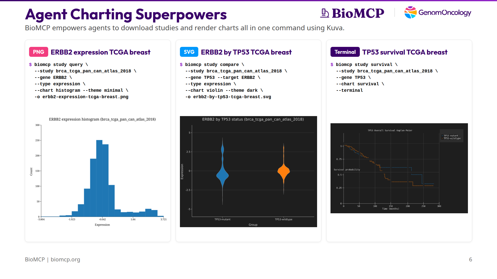

You downloaded a cBioPortal study. Now you want to see what's in it — survival differences, mutation patterns, expression distributions, co-mutation relationships. Normally that means opening R, writing ggplot code, managing dependencies, and iterating in a notebook.

BioMCP ships 10 chart types compiled directly into the binary. No Python, no R, no subprocess calls, no package installs. One command produces a chart in three formats:

- **Terminal** — Unicode Braille characters rendered inline. Your agent sees the chart in its own context window. You see it in your terminal. No files, no round-trips.
- **SVG** — structured XML that agents can parse for exact values. 36x smaller than PNG. Perfect for pipelines.
- **PNG** — for humans, presentations, and social media.

The charting engine is [Kuva](https://github.com/Psy-Fer/kuva), an open-source Rust library linked at compile time. It's part of the binary — not a dependency you install.

## The 10 chart types

### 1. Bar

Mutation class counts for a single gene. The first thing you run to understand a gene's mutation landscape.

```
$ biomcp study query --study msk_impact_2017 --gene TP53 \
    --type mutations --chart bar --terminal
```

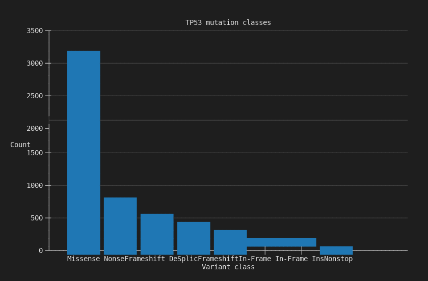

3,157 missense mutations dominate TP53 in MSK-IMPACT, followed by 683 nonsense and 517 frameshift deletions.

### 2. Pie

Same mutation data as proportions. Useful when the relative share matters more than absolute counts.

```
$ biomcp study query --study brca_tcga_pan_can_atlas_2018 \
    --gene TP53 --type mutations --chart pie --terminal
```

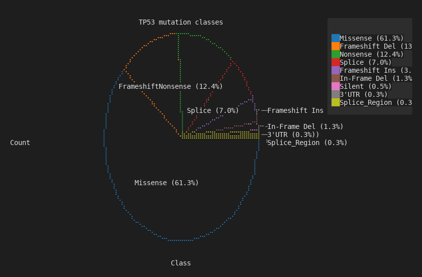

Braille circle rendering — missense 61.3%, frameshift deletion 13%, nonsense 12.4%.

### 3. Histogram

Expression distribution for a single gene. Reveals bimodal patterns, outliers, and subgroups.

```
$ biomcp study query --study brca_tcga_pan_can_atlas_2018 \
    --gene ERBB2 --type expression --chart histogram --terminal
```

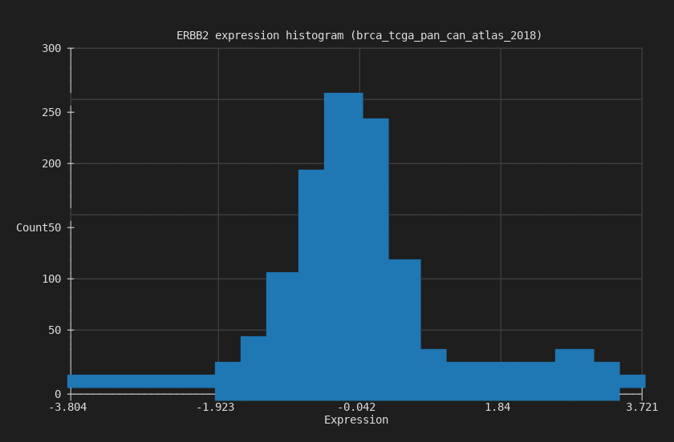

The right-hand bump is the HER2-amplified subgroup — roughly 15-20% of breast cancers.

### 4. Density

Smoothed kernel density estimate of the same expression data. Cleaner view of the distribution shape.

```
$ biomcp study query --study brca_tcga_pan_can_atlas_2018 \
    --gene ERBB2 --type expression --chart density --terminal
```

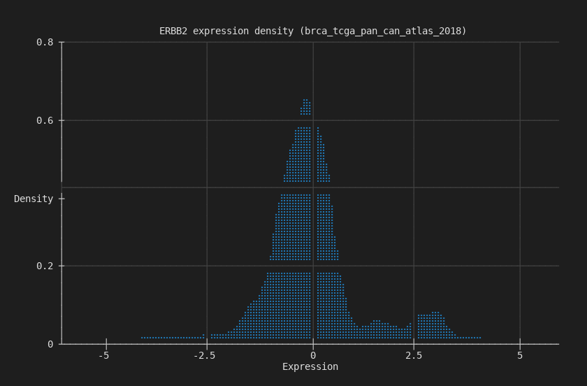

### 5. Box

Expression grouped by mutation status. Whiskers, quartiles, outliers — the standard statistical summary.

```
$ biomcp study compare --study brca_tcga_pan_can_atlas_2018 \
    --gene TP53 --target ERBB2 --type expression \
    --chart box --terminal
```

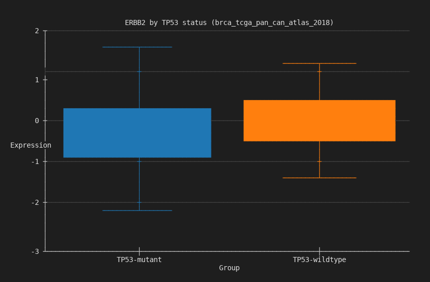

ERBB2 expression stratified by TP53 mutation status.

### 6. Violin

Same grouped comparison, but showing the full distribution shape instead of just quartiles.

```
$ biomcp study compare --study brca_tcga_pan_can_atlas_2018 \
    --gene TP53 --target ERBB2 --type expression \
    --chart violin --terminal
```

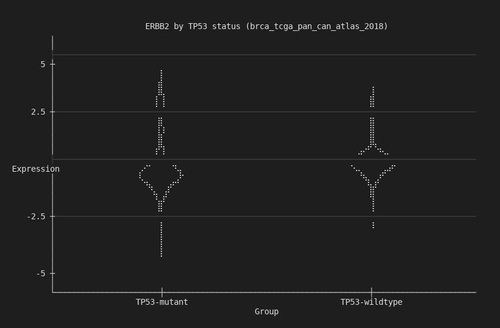

The bimodal HER2 pattern is visible in both groups.

### 7. Ridgeline

Overlapping density curves stacked vertically. Best for comparing two distributions at a glance.

```
$ biomcp study compare --study brca_tcga_pan_can_atlas_2018 \
    --gene TP53 --target ERBB2 --type expression \
    --chart ridgeline --terminal
```

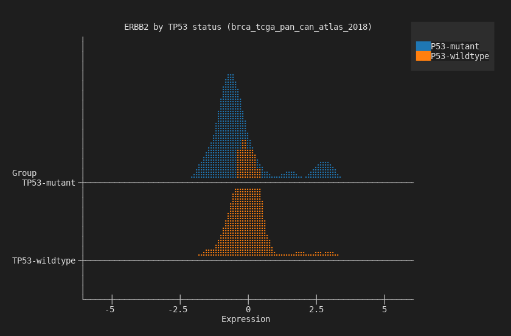

TP53-mutant (blue) vs wildtype (orange). The wildtype group has a wider right tail.

### 8. Survival (Kaplan-Meier)

Time-to-event curves split by mutation status. The chart most clinicians look at first.

```
$ biomcp study survival --study brca_tcga_pan_can_atlas_2018 \
    --gene TP53 --chart survival --terminal
```

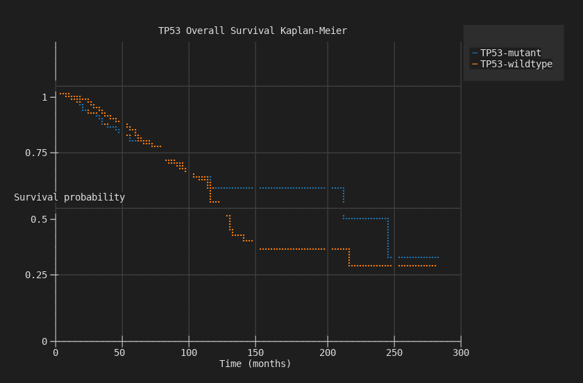

TP53-mutant patients have worse overall survival, with curves diverging over 300 months.

### 9. Heatmap

Co-mutation matrix across multiple genes. Viridis colormap with Braille rendering — the most visually striking terminal chart.

```
$ biomcp study co-occurrence \
    --study brca_tcga_pan_can_atlas_2018 \
    --genes TP53,PIK3CA,GATA3,CDH1 \
    --chart heatmap --terminal
```

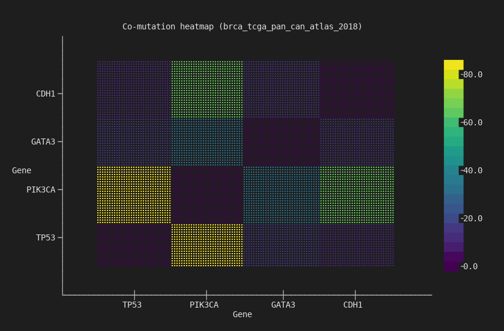

4x4 co-mutation matrix. TP53/PIK3CA has the strongest off-diagonal signal — the two most commonly co-mutated genes in breast cancer.

### 10. Stacked Bar

Mutation counts grouped and stacked by mutation status. Shows both the total count and the composition.

```
$ biomcp study compare --study brca_tcga_pan_can_atlas_2018 \
    --gene TP53 --target ERBB2 --type mutations \
    --chart stacked-bar --terminal
```

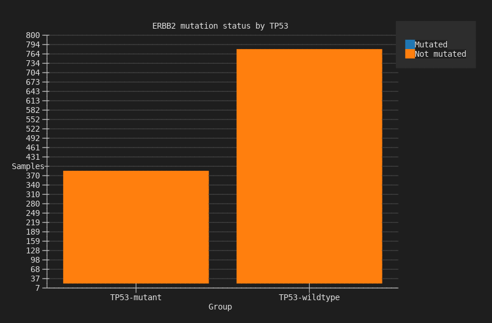

ERBB2 mutation counts stacked by TP53 status: mutated (blue) vs not-mutated (orange).

## Three formats, one flag

Every chart command accepts the same output options:

```bash
# Terminal — inline, no files
biomcp study survival ... --chart survival --terminal

# SVG — structured, parseable, 36x smaller than PNG
biomcp study survival ... --chart survival -o survival.svg

# PNG — for presentations and sharing
biomcp study survival ... --chart survival -o survival.png
```

SVG is the best format for agents. An agent can parse `<rect height="405.9">` to recover exact values without a vision model. Terminal is the best format for interactive exploration — the chart appears right in your output stream.

## Themes and accessibility

Four themes and twelve color palettes, including five designed for colorblind accessibility:

```bash
biomcp study query ... --chart bar --theme dark --palette wong
```

| Themes | Accessible palettes |
|--------|-------------------|
| `light`, `dark`, `solarized`, `minimal` | `wong`, `okabe-ito`, `deuteranopia`, `protanopia`, `tritanopia` |

## Try it

```bash
uv tool install biomcp-cli
biomcp study download msk_impact_2017
biomcp study survival --study msk_impact_2017 --gene TP53 \
  --chart survival --terminal
biomcp study co-occurrence --study msk_impact_2017 \
  --genes TP53,KRAS,PIK3CA,BRAF --chart heatmap --terminal
```

Download a study, chart it. No setup, no dependencies, no code.
