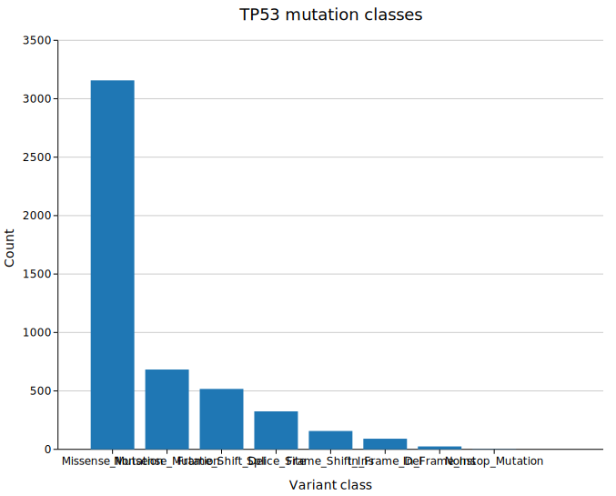
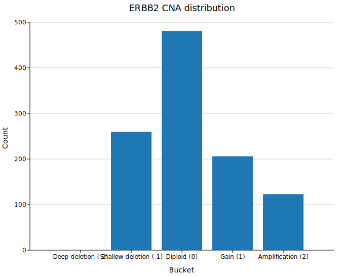
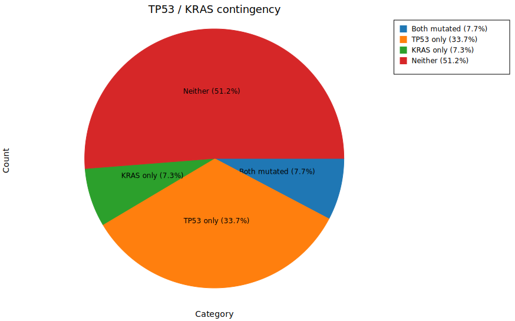
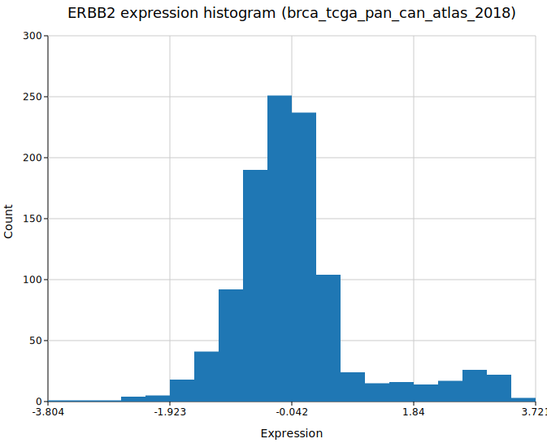
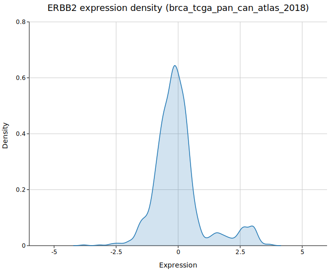
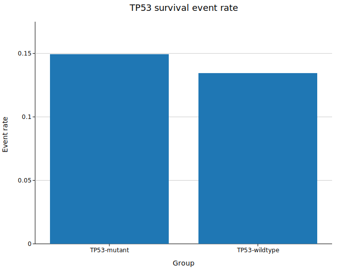

# Native Study Charts in BioMCP with Kuva

*How BioMCP turned cBioPortal study summaries into terminal charts and AI-readable SVG in one command.*

BioMCP study commands already knew how to answer useful questions: mutation burden, copy-number distributions, expression ranges, co-occurrence counts, and stratified comparisons. The missing piece was visualization. Before this change, terminal users had to emit JSON, reshape it with `jq`, and then hand the result to `kuva`.

This release removes that glue step. The same study commands now render directly to the terminal or write SVG and PNG files with a shared `--chart` surface.

## Why this matters

- Researchers can explore study data without leaving the CLI.
- The chart type is validated against the command and data shape, so invalid combinations fail early with a useful message.
- SVG is now a first-class output path for agent workflows. Agents can read exact numeric values from SVG attributes instead of estimating them from pixels.

## Setup

These examples use downloaded local cBioPortal studies:

- `msk_impact_2017`
- `brca_tcga_pan_can_atlas_2018`

Download the BRCA study before generating the BRCA-based charts:

```bash
biomcp study download brca_tcga_pan_can_atlas_2018
```

Terminal output is useful for quick exploration. SVG is the better default when the result will be shared, embedded in docs, or parsed by an AI agent.

## The nine worked examples

### 1. TP53 mutation classes as a bar chart

```bash
biomcp study query --study msk_impact_2017 --gene TP53 --type mutations \
  --chart bar -o docs/blog/images/tp53-mutation-bar.svg
```



Use this when you want the fastest read on which mutation classes dominate a gene in a study.


### 2. ERBB2 copy-number distribution as SVG

```bash
biomcp study query --study brca_tcga_pan_can_atlas_2018 --gene ERBB2 --type cna \
  --chart bar -o docs/blog/images/erbb2-cna-bar.svg
```



This produces a publication-friendly vector chart showing deep deletions, shallow deletions, diploid samples, gains, and amplifications.


### 3. TP53 and KRAS co-occurrence as a pie chart

```bash
biomcp study co-occurrence --study msk_impact_2017 --genes TP53,KRAS \
  --chart pie -o docs/blog/images/tp53-kras-cooccurrence-pie.svg
```



The pie slices map directly to the four contingency buckets: both mutated, TP53 only, KRAS only, and neither.


### 4. ERBB2 expression histogram

```bash
biomcp study query --study brca_tcga_pan_can_atlas_2018 --gene ERBB2 --type expression \
  --chart histogram -o docs/blog/images/erbb2-expression-histogram.svg
```



This is the quickest way to see whether expression values are tightly clustered or broadly spread across the cohort.


### 5. ERBB2 expression density curve

```bash
biomcp study query --study brca_tcga_pan_can_atlas_2018 --gene ERBB2 --type expression \
  --chart density -o docs/blog/images/erbb2-expression-density.svg
```



The density plot smooths the same expression values into a KDE view that is easier to compare visually across studies or genes.

### 6. ERBB2 expression by TP53 status as a box plot

```bash
biomcp study compare --study brca_tcga_pan_can_atlas_2018 \
  --gene TP53 --type expression --target ERBB2 \
  --chart box -o docs/blog/images/erbb2-by-tp53-box.svg
```


Box plots are useful when you want medians, interquartile ranges, and outliers without the visual weight of a full distribution plot.


### 7. ERBB2 expression by TP53 status as a violin plot

```bash
biomcp study compare --study brca_tcga_pan_can_atlas_2018 \
  --gene TP53 --type expression --target ERBB2 \
  --chart violin -o docs/blog/images/erbb2-by-tp53-violin.svg
```


The violin view keeps the same grouping but shows the full shape of each distribution.


### 8. ERBB2 expression by TP53 status as a ridgeline plot

```bash
biomcp study compare --study brca_tcga_pan_can_atlas_2018 \
  --gene TP53 --type expression --target ERBB2 \
  --chart ridgeline -o docs/blog/images/erbb2-by-tp53-ridgeline.svg
```


Ridgelines work well when you want stacked densities and stronger separation between groups.


### 9. TP53 survival event rate by mutation status

```bash
biomcp study survival --study brca_tcga_pan_can_atlas_2018 --gene TP53 \
  --chart bar -o docs/blog/images/tp53-survival-bar.svg
```



This ticket intentionally charts the existing survival summary output as event-rate bars rather than attempting a Kaplan-Meier curve.


## Styling and output

All chart-capable study commands share the same styling flags:

```bash
biomcp study query --study msk_impact_2017 --gene TP53 --type mutations \
  --chart bar --terminal \
  --title "TP53 mutation classes" \
  --theme dark \
  --palette wong
```

- `--theme` accepts `light`, `dark`, `solarized`, and `minimal`
- `--palette` accepts `category10`, `wong`, `okabe-ito`, `tol-bright`, `tol-muted`, `tol-light`, `ibm`, `deuteranopia`, `protanopia`, `tritanopia`, `pastel`, and `bold`
- `-o file.svg` writes vector output
- `-o file.png` works when BioMCP is built with `--features charts-png`

If you omit `--terminal` and `-o`, BioMCP defaults to terminal rendering in chart mode.

For additional chart-specific help, use:

```bash
biomcp chart
biomcp chart violin
```

## Invalid combinations fail clearly

The command surface is intentionally strict. Chart types are bound to the data shape behind each command.

For example, this is rejected:

```bash
biomcp study query --study msk_impact_2017 --gene TP53 --type mutations \
  --chart violin --terminal
```

BioMCP reports that `violin` is invalid for `study query --type mutations` and lists the valid alternatives: `bar, pie`.

## Why SVG is the best handoff format for agents

Terminal rendering is excellent for exploration, but it is still a raster-like presentation. Small bars and thin differences can disappear in a fixed terminal grid.

SVG is different: it is structured text. An agent can read numeric geometry directly from elements like:

```xml
<rect x="..." y="..." width="..." height="..."/>
```

That makes SVG the recommended output when the chart needs to be inspected programmatically or attached to an AI analysis workflow.

## What changed under the hood

- BioMCP now links `kuva 0.1.4` directly as a Rust library.
- Chart rendering is wired into the existing `study` commands instead of creating a separate pipeline.
- `biomcp chart` exposes embedded markdown help for each chart family.
- Short help (`-h`) stays compact, while full help (`--help`) shows the chart flags.

## Try it

Start with the terminal for fast iteration:

```bash
biomcp study query --study msk_impact_2017 --gene TP53 --type mutations \
  --chart bar --terminal
```

Then switch to SVG once you want a durable artifact:

```bash
biomcp study query --study msk_impact_2017 --gene TP53 --type mutations \
  --chart bar -o docs/blog/images/tp53-mutation-bar.svg
```
