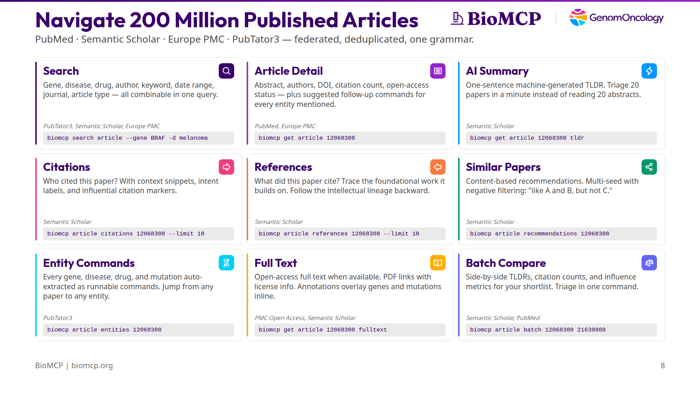

# Navigate 200 Million Published Articles with BioMCP



BioMCP federates PubMed, Semantic Scholar, Europe PMC, and PubTator3 into a single article CLI. Search, read, triage, traverse citation graphs, extract entities, and compare papers — all without leaving the terminal. Nine capabilities, one grammar.

## 1. Search

Find papers by gene, disease, drug, author, keyword, date range, journal, article type, or any combination. Results are deduplicated across sources and ranked by relevance.

```
$ biomcp search article --gene BRAF -d melanoma --limit 5

# Articles: gene=BRAF, disease=melanoma, sort=relevance

| PMID     | Title                                              | Source(s)         | Date | Cit. |
|----------|----------------------------------------------------|-------------------|------|------|
| 30544808 | Oleuropein, the Main Polyphenol of Olea europaea…  | Semantic Scholar  | 2018 | 100  |
| 29295999 | ERK-mediated phosphorylation regulates SOX10…      | Semantic Scholar  | 2018 | 70   |
| 26790143 | p53 Reactivation by PRIMA-1(Met) sensitises…       | Semantic Scholar  | 2016 | 52   |
| 28455392 | Biomarker Accessible and Chemically Addressable…   | Semantic Scholar  | 2017 | 45   |
```

You can stack filters: `--gene BRAF --drug vemurafenib --since 2020 --type review --sort citations`. Twelve filter options, all combinable.

## 2. Article Detail

Get the abstract, authors, DOI, citation count, open-access status, and suggested follow-up commands in one call.

```
$ biomcp get article 12068308

# Mutations of the BRAF gene in human cancer.

PMID: 12068308
DOI: 10.1038/nature00766
Journal: Nature
Date: 2002-06-27
Citations: 7469
Type: research support, non-u.s. gov't
Open Access: No
```

BioMCP auto-generates follow-up commands for every gene, drug, disease, and mutation mentioned in the abstract. You don't have to know the identifiers — they're extracted for you.

## 3. AI Summary (TLDR)

Semantic Scholar generates a one-sentence machine summary for most papers. Instead of reading the full abstract, get the TLDR.

```
$ biomcp get article 12068308 tldr

TLDR: BRAF somatic missense mutations in 66% of malignant melanomas
and at lower frequency in a wide range of human cancers, with a single
substitution (V599E) accounting for 80%.

Citations: 10,599
Influential citations: 532
References: 28
```

Two citation counts: PubMed's 7,469 (MEDLINE-indexed) vs Semantic Scholar's 10,599 (includes preprints and conference papers). The "influential citations" count (532) is Semantic Scholar's metric for citations that meaningfully shaped the citing work.

## 4. Citations

Who cited this paper? Semantic Scholar returns forward citations with context snippets, intent labels, and influence markers.

```
$ biomcp article citations 12068308 --limit 3

# Citations for PMID 12068308

| PMID | Title                                              | Intents | Influential |
|------|----------------------------------------------------|---------|-------------|
| …    | FDG PET/CT as the Decisive Modality in…            | -       | no          |
| …    | Associations of Tumor Somatic Mutations and…       | -       | no          |
| …    | A Complete Response to Immunotherapy in a…          | -       | no          |
```

When available, each citation includes a context snippet (the sentence where your paper was cited) and an intent label (Background, Method, or Result). This tells you *why* someone cited a paper, not just *that* they did.

## 5. References

What did this paper cite? Trace the foundational work backward.

```
$ biomcp article references 12068308 --limit 5
```

Same structure as citations but in the opposite direction. Follow the intellectual lineage to find the papers that a given work builds on. Useful for literature reviews: start with a recent review, then walk backward through its reference list.

## 6. Similar Papers

Content-based recommendations from Semantic Scholar. Finds related work by meaning, not just shared keywords.

```
$ biomcp article recommendations 12068308 --limit 3

# Recommendations for PMID 12068308

| PMID | Title                                              | Journal         | Year |
|------|----------------------------------------------------|-----------------|------|
| …    | Oncogenes and tumor suppressor genes enriched in…  | bioRxiv         | 2026 |
| …    | Genome-wide CRISPR Screen Identifies Menin as…     | Cancer Research | 2026 |
| …    | Pancreas cancer: Genomics, RAS therapeutics…        | Cancer Research | 2026 |
```

Multi-seed with negative filtering: `biomcp article recommendations 12068308 21639808 --negative 39073865` finds papers similar to the first two but NOT similar to the third. Useful for narrowing a broad literature search.

## 7. Entity Commands

BioMCP extracts every gene, disease, drug, and mutation from a paper and turns them into runnable commands. This is the bridge between articles and everything else in BioMCP.

```
$ biomcp article entities 12068308

## Genes (3)

| Entity | Mentions | Next Command              |
|--------|----------|---------------------------|
| BRAF   | 4        | biomcp get gene BRAF      |
| MEK    | 1        | biomcp get gene MEK       |
| RAF    | 1        | biomcp get gene RAF       |

## Diseases (4)

| Entity             | Mentions | Next Command                              |
|--------------------|----------|-------------------------------------------|
| cancer             | 5        | biomcp search disease --query cancer      |
| malignant melanoma | 1        | biomcp search disease --query "malignant… |
```

From any paper, jump to any entity. Get the gene's pathways, the drug's interactions, the disease's clinical trials — without looking up identifiers yourself.

## 8. Full Text

Retrieve open-access full text when available. Semantic Scholar provides PDF links with license info.

```
$ biomcp get article PMC9984800 fulltext

# Precision oncology for BRAF-mutant cancers… - fulltext
## Full Text (PMC OA)

Saved to: /tmp/biomcp/b379bd903115c5acbb663120e8bed420.txt
```

Full text is retrieved from PubMed Central's Open Access subset. Not all papers are available — when they're not, BioMCP tells you and suggests alternatives (TLDR, annotations).

## 9. Batch Compare

Compare multiple papers side by side: TLDRs, citation counts, influence metrics, and extracted entities for your shortlist in one command.

```
$ biomcp article batch 12068308 21639808 22663011

## 1. Mutations of the BRAF gene in human cancer.
PMID: 12068308 | Nature | 2002
TLDR: BRAF somatic missense mutations in 66% of malignant melanomas,
V599E accounting for 80%.
Citations: 10,599 (influential: 532)

## 2. Improved survival with vemurafenib in melanoma with BRAF V600E mutation.
PMID: 21639808 | N Engl J Med | 2011
TLDR: Vemurafenib produced improved rates of overall and progression-free
survival in a phase 3 randomized clinical trial.
Citations: 6,756 (influential: 175)
```

Pass any number of PMIDs, PMCIDs, or DOIs. Useful for triage: run a search, pick your candidates, then batch them to compare TLDRs and citation metrics before deciding which papers to read in full.

## API Keys

BioMCP works out of the box with no API keys. All nine article capabilities are functional immediately after install. Two optional keys improve reliability:

**Semantic Scholar** (`S2_API_KEY`): Free key from [semanticscholar.org/product/api](https://www.semanticscholar.org/product/api). Without it, you share a rate limit with all unauthenticated users (1 request every 2 seconds). With the key, you get a dedicated rate limit (1 request per second). Citations, references, recommendations, TLDRs, and batch enrichment all benefit.

```bash
export S2_API_KEY="your-key-here"
```

**NCBI** (`NCBI_API_KEY`): Free key from [ncbiinsights.ncbi.nlm.nih.gov](https://ncbiinsights.ncbi.nlm.nih.gov/2017/11/02/new-api-keys-for-the-e-utilities/). PubTator3, PubMed, and PMC Open Access all use NCBI infrastructure. Without a key, you're limited to 3 requests per second. With the key, 10 requests per second.

```bash
export NCBI_API_KEY="your-key-here"
```

Check your configuration with `biomcp health --apis-only` — it shows which APIs are authenticated and which are using shared pools.

## Try it

```bash
uv tool install biomcp-cli
biomcp skill install
```

Then start with a paper you know:

```bash
biomcp search article --gene <your-gene> --limit 10
biomcp get article <pmid>
biomcp article citations <pmid> --limit 5
biomcp article entities <pmid>
```
