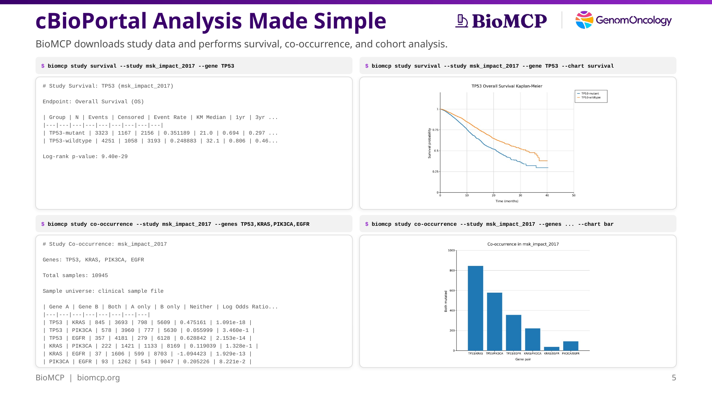
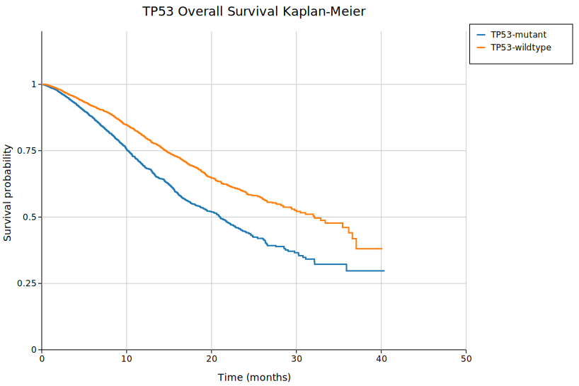
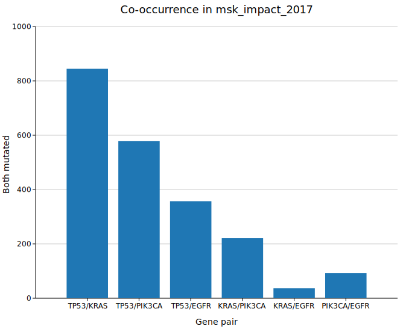

# cBioPortal Study Analytics in BioMCP

*Download real cancer genomics studies. Run survival analysis, co-occurrence, and cohort comparisons. Generate charts. All from the command line.*



BioMCP can download cBioPortal study datasets and run analytics locally — no browser, no R, no Jupyter notebooks. You get structured data and publication-quality charts from the same commands.

This post walks through what the study analytics surface does, how it works under the hood, and how Kuva powers the charting.

## What you can do

BioMCP's `study` commands cover five analysis types:

| Command | What it does |
|---------|-------------|
| `study query` | Mutation frequency, CNA distribution, expression values for a gene |
| `study survival` | Kaplan-Meier survival analysis stratified by mutation status |
| `study co-occurrence` | Pairwise mutation co-occurrence with log odds ratios and p-values |
| `study compare` | Expression or mutation rate comparison between mutation-stratified groups |
| `study cohort` | Sample-level cohort construction by mutation status |

Every command works on locally downloaded cBioPortal datasets. Download once, query as many times as you want:

```bash
biomcp study download msk_impact_2017
biomcp study download brca_tcga_pan_can_atlas_2018
```

## Survival analysis

The `study survival` command stratifies patients by mutation status and computes Kaplan-Meier estimates with log-rank testing.

```bash
biomcp study survival --study msk_impact_2017 --gene TP53
```

```
# Study Survival: TP53 (msk_impact_2017)

Endpoint: Overall Survival (OS)

| Group | N | Events | Censored | Event Rate | KM Median | 1yr | 3yr | 5yr |
|---|---|---|---|---|---|---|---|---|
| TP53-mutant | 3323 | 1167 | 2156 | 0.351189 | 21.0 | 0.694 | 0.297 | 0.297 |
| TP53-wildtype | 4251 | 1058 | 3193 | 0.248883 | 32.1 | 0.806 | 0.461 | 0.381 |

Log-rank p-value: 9.40e-29
```

TP53-mutant patients have a median overall survival of 21.0 months versus 32.1 months for wildtype — a difference that's statistically overwhelming (p = 9.40e-29). This is consistent with TP53's well-established role as a prognostic marker across cancer types.

Add `--chart survival` to get a Kaplan-Meier curve:

```bash
biomcp study survival --study msk_impact_2017 --gene TP53 \
  --chart survival -o tp53-survival.svg
```



The survival curve shows clear separation between the two groups from the first months of follow-up, with the gap widening through the observation period.

## Co-occurrence analysis

The `study co-occurrence` command computes pairwise mutation co-occurrence across a set of genes. It reports contingency counts, log odds ratios, and Fisher's exact test p-values.

```bash
biomcp study co-occurrence --study msk_impact_2017 \
  --genes TP53,KRAS,PIK3CA,EGFR
```

```
# Study Co-occurrence: msk_impact_2017

Genes: TP53, KRAS, PIK3CA, EGFR

Total samples: 10945

| Gene A | Gene B | Both | A only | B only | Neither | Log Odds Ratio | p-value |
|---|---|---|---|---|---|---|---|
| TP53 | KRAS | 845 | 3693 | 798 | 5609 | 0.475 | 1.091e-18 |
| TP53 | PIK3CA | 578 | 3960 | 777 | 5630 | 0.056 | 3.460e-1 |
| TP53 | EGFR | 357 | 4181 | 279 | 6128 | 0.629 | 2.153e-14 |
| KRAS | PIK3CA | 222 | 1421 | 1133 | 8169 | 0.119 | 1.328e-1 |
| KRAS | EGFR | 37 | 1606 | 599 | 8703 | -1.094 | 1.929e-13 |
| PIK3CA | EGFR | 93 | 1262 | 543 | 9047 | 0.205 | 8.221e-2 |
```

The standout finding: **KRAS and EGFR are mutually exclusive** (log odds ratio -1.094, p = 1.93e-13). Only 37 of 10,945 samples carry both mutations. This is a well-known biological pattern — both genes activate the same RAS-MAPK signaling pathway, so mutating both provides no selective advantage.

Add `--chart bar` for a visual:

```bash
biomcp study co-occurrence --study msk_impact_2017 \
  --genes TP53,KRAS,PIK3CA,EGFR --chart bar -o cooccurrence.svg
```



## How the study analytics work

BioMCP downloads cBioPortal study data as tab-separated files and stores them locally. When you run a query, BioMCP reads these files directly — no API calls, no network latency, no rate limits.

The survival analysis implementation:

1. **Mutation stratification** — Samples are split into mutant and wildtype groups based on the mutation data file.
2. **Clinical data join** — Overall survival status and months are pulled from the clinical data file and matched to each sample.
3. **Kaplan-Meier estimation** — Survival probabilities are computed at each event time using the standard product-limit estimator.
4. **Log-rank test** — A chi-squared statistic compares the two survival curves. The p-value comes from a chi-squared distribution with one degree of freedom.

The co-occurrence analysis:

1. **Mutation extraction** — For each gene, BioMCP identifies which samples carry at least one mutation.
2. **Contingency tables** — For every pair of genes, samples are counted in four buckets: both mutated, A only, B only, neither.
3. **Log odds ratio** — Computed from the 2×2 contingency table. Positive values indicate co-occurrence; negative values indicate mutual exclusivity.
4. **Fisher's exact test** — P-values are computed using the exact hypergeometric distribution, not an approximation.

All of this runs locally in Rust. A survival analysis across 10,945 samples completes in milliseconds.

## Charting with Kuva

BioMCP's charts are powered by [Kuva](https://github.com/Psy-Fer/kuva), an open-source Rust charting library built for this use case. Kuva renders to both terminal (Unicode block characters) and SVG.

Why a custom charting library instead of calling out to Python or R:

- **No runtime dependencies.** BioMCP is a single binary. Adding a Python or R dependency would break that property.
- **Terminal-first.** Kuva renders charts directly in the terminal using Unicode block characters. You see the chart where you ran the command.
- **SVG as structured data.** Kuva's SVG output includes exact numeric values in element attributes, making it parseable by AI agents without vision models.
- **Validated chart types.** Each study command declares which chart types are valid for its data shape. Invalid combinations fail with a clear error message instead of producing garbage.

The nine supported chart types: `bar`, `pie`, `histogram`, `density`, `box`, `violin`, `ridgeline`, `survival`, and custom comparison charts.

## Available studies

BioMCP ships with three downloadable studies:

| Study | Cancer Type | Samples |
|-------|------------|---------|
| `msk_impact_2017` | Pan-cancer (mixed) | 10,945 |
| `brca_tcga_pan_can_atlas_2018` | Breast cancer | 1,084 |
| `brca_sanger` | Breast cancer | 100 |

```bash
biomcp study list
biomcp study download msk_impact_2017
```

## Try it

Install BioMCP and download a study:

```bash
uv tool install biomcp-cli
biomcp study download msk_impact_2017
```

Run your first survival analysis:

```bash
biomcp study survival --study msk_impact_2017 --gene TP53
biomcp study survival --study msk_impact_2017 --gene TP53 --chart survival
```

Explore co-occurrence:

```bash
biomcp study co-occurrence --study msk_impact_2017 \
  --genes TP53,KRAS,PIK3CA,EGFR --chart bar
```

Full documentation: [Chart Reference](../charts/index.md).
