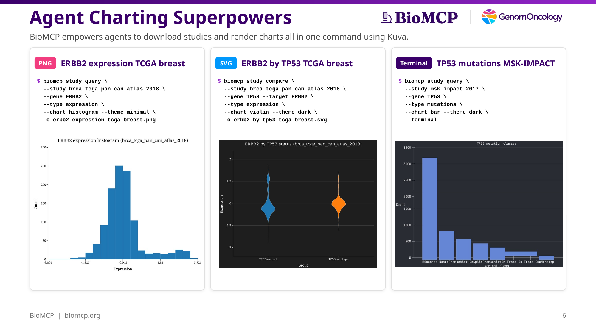
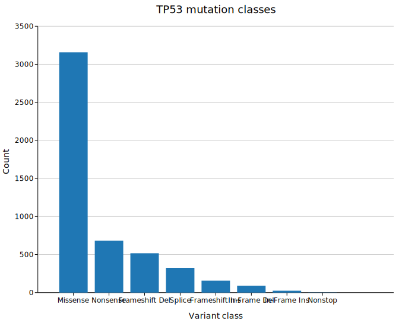
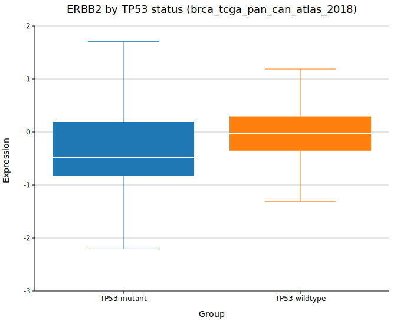
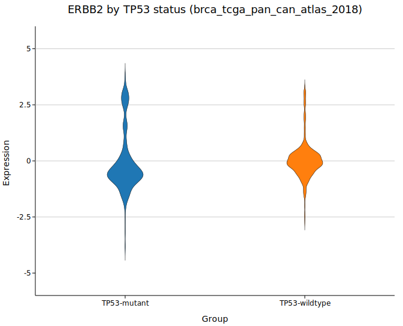
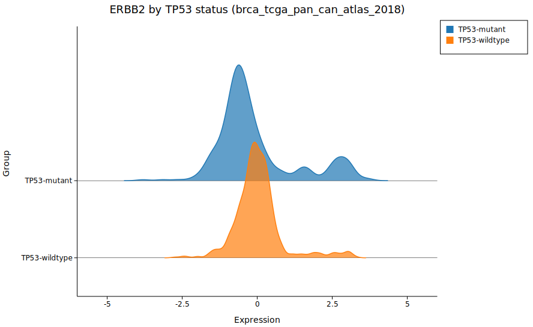
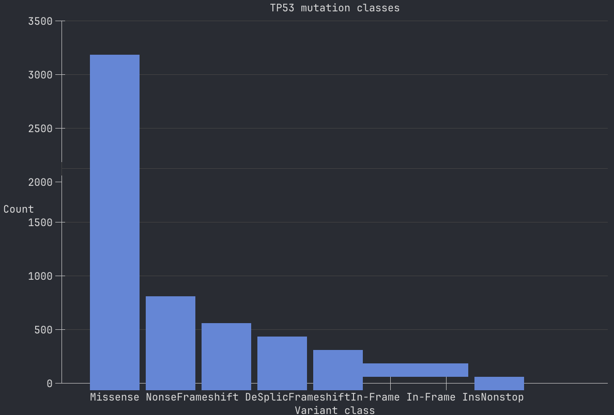
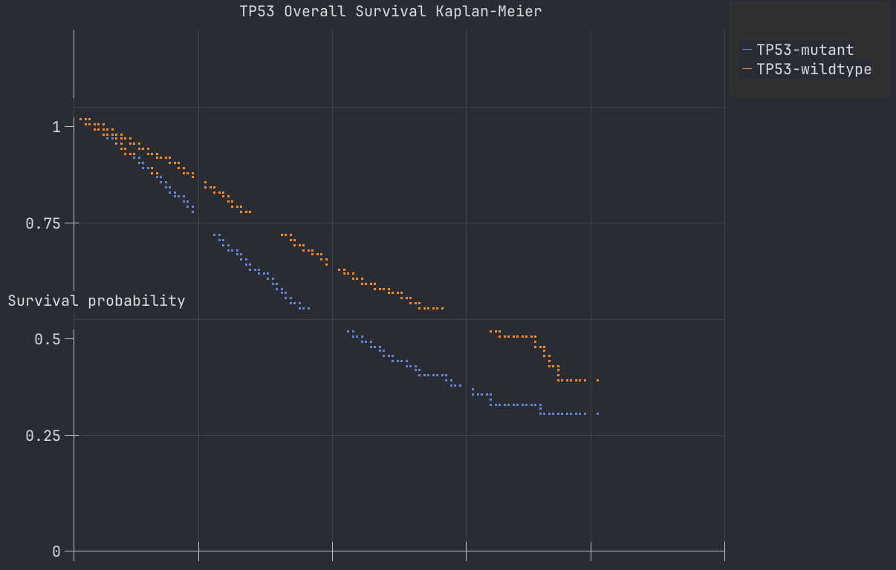

# Every Chart BioMCP Can Make

*You already have the data. Why should you need R and 40 lines of ggplot2 just to see it?*



You've downloaded a cBioPortal study. You've queried mutation frequencies, run survival analysis, compared expression across groups. BioMCP gave you clean tables. But now you want to *see* it — a survival curve, a distribution, a co-occurrence pattern — and suddenly you're exporting CSVs, opening Jupyter, importing matplotlib, debugging axis labels.

That's the gap BioMCP's charting closes. Add `--chart` to any study command you're already running. The chart renders to your terminal, to SVG, or to PNG. Same command. One extra flag. No plotting libraries to install because the charting engine — [Kuva](https://github.com/Psy-Fer/kuva), an open-source Rust library — is compiled into the BioMCP binary.

Here's every chart type BioMCP supports, what it's good for, and why SVG turns out to be surprisingly useful for AI agents.

## The eight chart types

Add `--chart <type>` to a study command. BioMCP validates the chart type against the data shape — if you ask for a violin plot from a mutation query, it tells you what's valid instead of producing garbage.

### 1. Bar chart

Best for: categorical counts. Mutation classes, CNA types, co-occurrence buckets.

```bash
biomcp study query --study msk_impact_2017 --gene TP53 --type mutations \
  --chart bar -o tp53-mutation-bar.svg
```



TP53 in MSK-IMPACT: 3,157 missense mutations dominate, followed by 683 nonsense and 517 frameshift deletions. The bar chart makes the relative proportions immediately obvious.

### 2. Pie chart

Best for: proportional breakdowns where you want to see parts of a whole.

```bash
biomcp study co-occurrence --study msk_impact_2017 --genes TP53,KRAS \
  --chart pie -o tp53-kras-pie.svg
```


The four contingency buckets: both mutated, TP53 only, KRAS only, neither. The "neither" slice dominates — most samples don't carry mutations in either gene.

### 3. Histogram

Best for: continuous distributions. Expression values, scores.

```bash
biomcp study query --study brca_tcga_pan_can_atlas_2018 --gene ERBB2 \
  --type expression --chart histogram -o erbb2-histogram.svg
```


ERBB2 expression in TCGA breast cancer. The bimodal distribution is the signature of HER2-positive breast cancer — the right-hand bump represents the ~15-20% of breast cancers with HER2 amplification.

### 4. Density plot

Best for: smooth continuous distributions. Same data as histogram but easier to compare across groups.

```bash
biomcp study query --study brca_tcga_pan_can_atlas_2018 --gene ERBB2 \
  --type expression --chart density -o erbb2-density.svg
```


The kernel density estimate smooths the same ERBB2 expression data into a continuous curve. The bimodal peaks are clearer here than in the histogram.

### 5. Box plot

Best for: comparing distributions between groups. Medians, quartiles, outliers at a glance.

```bash
biomcp study compare --study brca_tcga_pan_can_atlas_2018 \
  --gene TP53 --type expression --target ERBB2 \
  --chart box -o erbb2-by-tp53-box.svg
```



ERBB2 expression stratified by TP53 mutation status. The box plot shows medians, interquartile ranges, and outliers without visual clutter.

### 6. Violin plot

Best for: comparing full distribution shapes between groups. More informative than box plots when distributions are multimodal.

```bash
biomcp study compare --study brca_tcga_pan_can_atlas_2018 \
  --gene TP53 --type expression --target ERBB2 \
  --chart violin -o erbb2-by-tp53-violin.svg
```



Same comparison as the box plot, but the violin shape reveals the full distribution. The bimodal ERBB2 pattern is visible in both TP53-mutant and wildtype groups.

### 7. Ridgeline plot

Best for: stacked density comparisons. Cleaner than overlapping violins when you have more than two groups.

```bash
biomcp study compare --study brca_tcga_pan_can_atlas_2018 \
  --gene TP53 --type expression --target ERBB2 \
  --chart ridgeline -o erbb2-by-tp53-ridgeline.svg
```



Ridgelines stack the density curves vertically with overlap, making it easy to compare group shapes side by side.

### 8. Kaplan-Meier survival curve

Best for: time-to-event comparisons between mutation-stratified groups.

```bash
biomcp study survival --study msk_impact_2017 --gene TP53 \
  --chart survival -o tp53-survival.svg
```


TP53-mutant patients in MSK-IMPACT have worse overall survival (median 21.0 vs 32.1 months, p = 9.40e-29). The Kaplan-Meier curve shows clear separation from the start.

## Which chart type for which command

Not every chart type works with every command. BioMCP validates this for you.

| Command | Valid Chart Types |
|---------|------------------|
| `study query --type mutations` | `bar`, `pie` |
| `study query --type cna` | `bar`, `pie` |
| `study query --type expression` | `histogram`, `density` |
| `study co-occurrence` | `pie`, `bar` |
| `study compare --type expression` | `box`, `violin`, `ridgeline` |
| `study compare --type mutations` | `bar` |
| `study survival` | `bar`, `survival` |

If you ask for a violin chart from a mutation query, BioMCP tells you what's valid instead of producing garbage.

## Output formats: SVG vs PNG vs terminal

| Format | Flag | Size | AI readability | Best for |
|--------|------|------|---------------|----------|
| Terminal | `--terminal` | 0 bytes | ~90% accuracy | Quick exploration |
| SVG | `-o file.svg` | 2-45 KB | 100% accuracy | Sharing, docs, AI workflows |
| PNG | `-o file.png` | 100-500 KB | ~97% accuracy | Presentations, social media |

### Why SVG is the best format for AI agents

SVG files are structured XML. An AI agent can parse SVG element attributes to recover exact numeric values:

```xml
<rect x="59" y="88.1" width="68.57" height="405.9" fill="#1f77b4"/>
```

From `height="405.9"` and the axis scale, the agent can recover the exact count: 3,157 missense mutations. No vision model needed. No OCR errors.

SVG is also dramatically smaller than PNG — the TP53 mutation bar chart is 4.9 KB as SVG versus ~175 KB as PNG. That's **36x smaller** with higher information fidelity.

## Styling

All charts support themes and accessible color palettes:

```bash
biomcp study query --study msk_impact_2017 --gene TP53 --type mutations \
  --chart bar --theme dark --palette wong
```

| Option | Values |
|--------|--------|
| `--theme` | `light`, `dark`, `solarized`, `minimal` |
| `--palette` | `category10`, `wong`, `okabe-ito`, `tol-bright`, `tol-muted`, `tol-light`, `ibm`, `deuteranopia`, `protanopia`, `tritanopia`, `pastel`, `bold` |
| `--title` | Any custom title string |

The `wong`, `okabe-ito`, `deuteranopia`, `protanopia`, and `tritanopia` palettes are designed for colorblind accessibility.

## Terminal charts: the underrated output

Most charting tools treat the terminal as an afterthought — if they support it at all. Kuva treats it as a first-class target. When you add `--chart` without `-o`, the chart renders right where you ran the command.

This matters more than it sounds:

**You never leave your flow.** You're querying mutation data, you add `--chart bar`, and the bar chart appears inline. No window switching. No file opening. You see the shape of the data and immediately run the next command.

**SSH works.** If you're running BioMCP on a remote server over SSH, terminal charts just work. No X11 forwarding, no port tunneling, no "download the PNG and open it locally."

**AI agents can read them.** A coding agent running BioMCP in a terminal session can see the chart output and reason about it — no vision model needed for the data tables, and the chart adds visual confirmation.

Kuva renders terminal charts using Unicode block characters for bar charts and Braille characters for continuous curves. The survival curve uses Braille dots to draw smooth step functions directly in your terminal — two overlapping Kaplan-Meier curves rendered in colored Unicode:

```bash
biomcp study survival --study msk_impact_2017 --gene TP53 \
  --chart survival --terminal
```

Here's what a bar chart looks like rendered directly in the terminal:



And a Kaplan-Meier survival curve using Braille characters — two overlapping step functions with a legend, axes, and gridlines, all in Unicode:



The fidelity is surprisingly good. You can see the separation between TP53-mutant and wildtype curves, the crossover points, and the censoring pattern — all without generating a file.

Terminal charts are the default when `--chart` is specified without `-o`. Think of them as the "quick look" and SVG as the "save for later."

## About Kuva

[Kuva](https://github.com/Psy-Fer/kuva) is an open-source Rust charting library with 29 plot types, SVG/PNG/PDF output, and a CLI binary. BioMCP links Kuva 0.1.4 directly as a Rust library — no subprocess calls, no runtime dependencies.

BioMCP uses 8 of Kuva's 29 chart types. The chart rendering is wired into the existing `study` commands rather than creating a separate pipeline, so every study command that produces data can also produce a chart.

## Try it

```bash
uv tool install biomcp-cli
biomcp study download msk_impact_2017
biomcp study query --study msk_impact_2017 --gene TP53 --type mutations \
  --chart bar --terminal
```

Full chart reference: [Chart Documentation](../charts/index.md).
