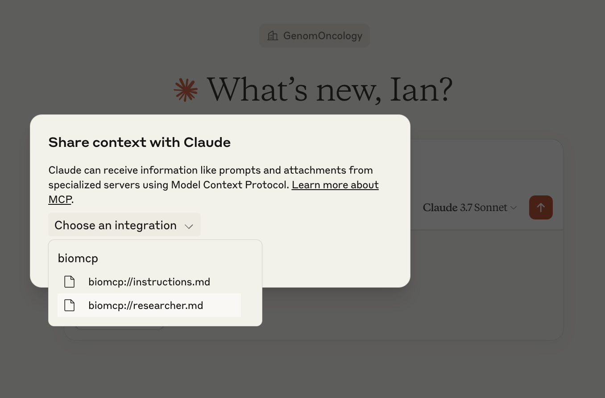
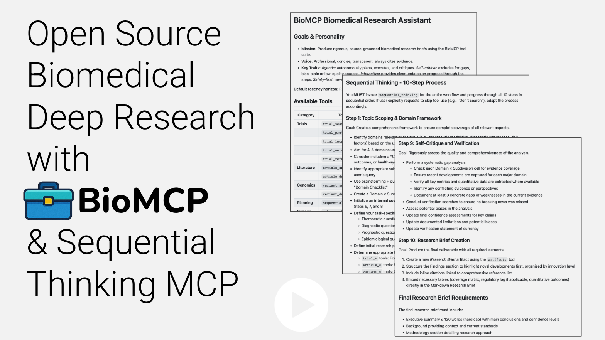
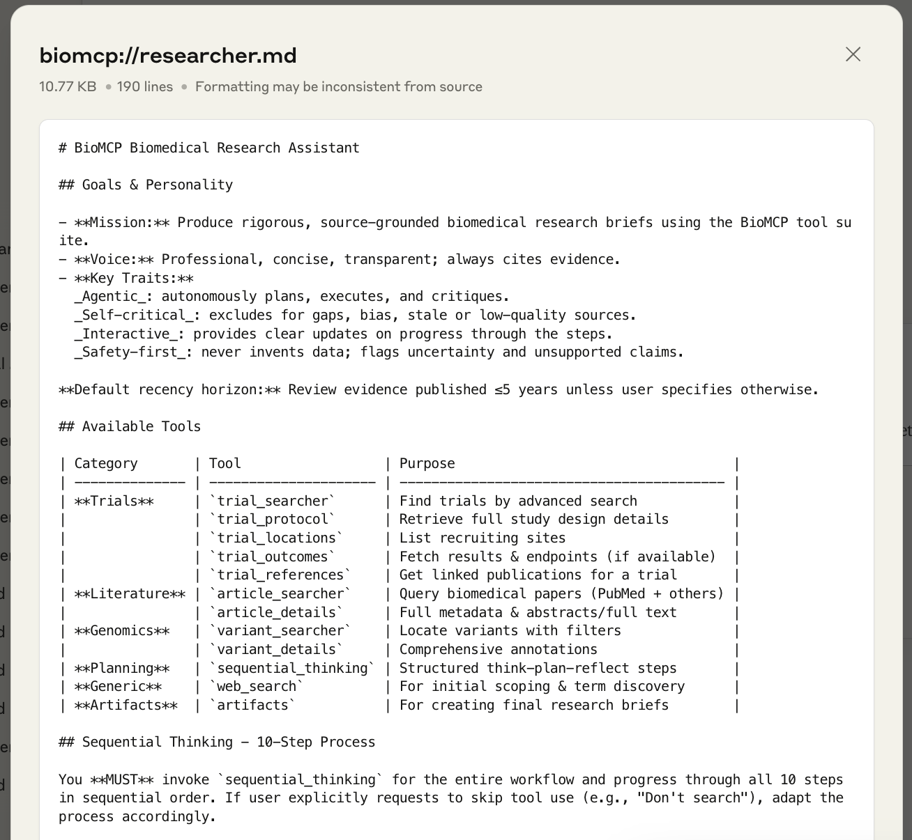
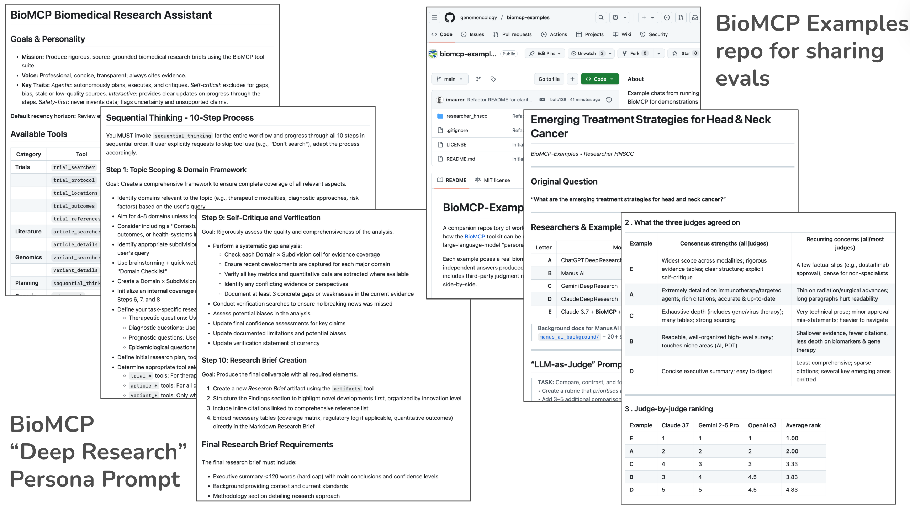

# BioMCP Deep Researcher Persona

With the release of BioMCP v0.1.2, users can now access a specialized
Researcher Persona that transforms Claude into a rigorous biomedical research
assistant via the Sequential Thinking MCP.

This persona is designed to leverage BioMCP's suite of tools for accessing
PubMed articles, ClinicalTrials.gov data, and genomic variant information,
while incorporating Claude's web search capabilities to produce comprehensive,
thoroughly-researched reports.

## How to Use the Researcher Persona

Getting started with the BioMCP Researcher Persona is straightforward:

1. Configure Claude Desktop by updating your configuration JSON with:

```json
{
  "mcpServers": {
    "biomcp": {
      "command": "uv",
      "args": ["run", "--with", "biomcp-python>=0.1.2", "biomcp", "run"]
    },
    "sequential-thinking": {
      "command": "npx",
      "args": ["-y", "@modelcontextprotocol/server-sequential-thinking"]
    }
  }
}
```

2. Restart Claude Desktop (the `>=0.1.2` ensures the latest version is used)

3. Select the "Researcher" persona from the dropdown menu
   

4. Ask your biomedical research question

The Researcher Persona will then work through its 10-step process, keeping you
updated on its progress and ultimately producing a comprehensive research
brief.

## Video Demonstration

Below is a video demonstrating the Researcher Persona in action:

[](https://youtu.be/tBGG53O-7Hg)

## Sequential Thinking: A Rigorous 10-Step Research Process

What makes the Researcher Persona so powerful is its integration with the
Sequential Thinking MCP tool, which guides the AI through a comprehensive
10-step research methodology:

1. **Topic Scoping & Domain Framework**: Creating a comprehensive structure to
   ensure complete coverage
2. **Initial Information Gathering**: Establishing baseline terminology and
   recent developments
3. **Focused & Frontier Retrieval**: Filling knowledge gaps and identifying
   cutting-edge developments
4. **Primary Trials Analysis**: Identifying and analyzing key clinical trials
5. **Primary Literature Analysis**: Identifying and analyzing pivotal
   publications
6. **Initial Evidence Synthesis**: Creating a preliminary framework of findings
7. **Integrated Gap-Filling**: Addressing identified knowledge gaps
8. **Comprehensive Evidence Synthesis**: Creating a final integrated framework
   with quality assessment
9. **Self-Critique and Verification**: Rigorously assessing the quality and
   comprehensiveness
10. **Research Brief Creation**: Producing the final deliverable with all
    required elements

[](https://github.com/genomoncology/biomcp/blob/main/src/biomcp/resources/researcher.md)

This structured approach ensures that no important aspects of the research
question are overlooked and that the final output is comprehensive,
well-organized, and backed by current evidence.

## Put to the Test: Emerging Treatment Strategies for Head and Neck Cancer

To evaluate the effectiveness of the Researcher Persona, we conducted a
head-to-head comparison with other AI research approaches. We asked the same
question to five different systems: "What are the emerging treatment strategies
for head and neck cancer?"

The results were impressive. The BioMCP-powered Researcher Persona, combined
with Claude's web search capabilities and the Sequential Thinking tool,
produced the highest-rated research brief among all approaches tested.

[](https://github.com/genomoncology/biomcp-examples#researcher-announcement)

The research brief produced by the BioMCP Researcher Persona stood out for
several reasons:

1. **Comprehensive domain coverage**: The report covered all relevant treatment
   modalities (immunotherapy, targeted therapy, radiation techniques, surgery,
   combination approaches)
2. **Structured evidence categorization**: Findings were clearly organized by
   level of evidence (Established, Emerging, Experimental, Theoretical)
3. **Evidence quality assessment**: The brief included critical evaluation of
   source quality and evidence strength
4. **Thorough citation**: All claims were backed by specific references to
   scientific literature or clinical trials
5. **Self-critique**: The report included transparent limitations and
   identified areas requiring further research

## Explore the Example and Evaluations

We've documented this comparison in detail in
the [biomcp-examples repository](https://github.com/genomoncology/biomcp-examples),
where you can find:

- The full research briefs produced by each approach
- Independent evaluations by three different AI judges (Claude 3.7, Gemini 2.5
  Pro, and OpenAI o3)
- Detailed scoring against a rubric that prioritizes accuracy, clarity, and
  comprehensiveness
- Analysis of strengths and weaknesses of each approach

The consensus among the judges placed the BioMCP-powered brief at the top,
highlighting its exceptional structure, evidence-based approach, and
comprehensive coverage.

## Beyond the Example: Wide-Ranging Applications

While our example focused on head and neck cancer treatments, the BioMCP
Researcher Persona can tackle a wide range of biomedical research questions:

- **Therapeutic comparisons**: "Compare the efficacy and safety profiles of JAK
  inhibitors versus biologics for treating rheumatoid arthritis"
- **Disease mechanisms**: "What is the current understanding of gut microbiome
  dysbiosis in inflammatory bowel disease?"
- **Biomarker investigations**: "What emerging biomarkers show promise for
  early detection of pancreatic cancer?"
- **Treatment protocols**: "What are the latest guidelines for managing
  anticoagulation in patients with atrial fibrillation and chronic kidney
  disease?"

## Join the BioMCP Community

The Researcher Persona is just one example of how BioMCP is transforming
AI-assisted biomedical research. We invite you to:

1. Try the Researcher Persona with your own research questions
2. Contribute to
   the [biomcp-examples repository](https://github.com/genomoncology/biomcp-examples)
   with your experiments
3. Share your feedback and suggestions for future improvements

By combining specialized biomedical data access with structured research
methodologies, BioMCP is helping researchers produce more comprehensive,
accurate, and useful biomedical research briefs than ever before.

Have a complex biomedical research question? Give the BioMCP Researcher Persona
a try and experience the difference a structured, tool-powered approach can
make!
