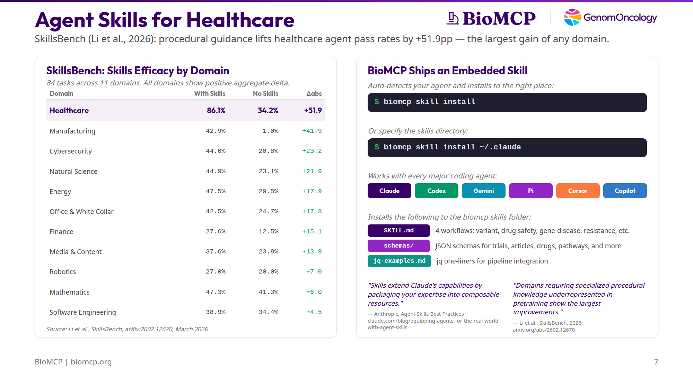
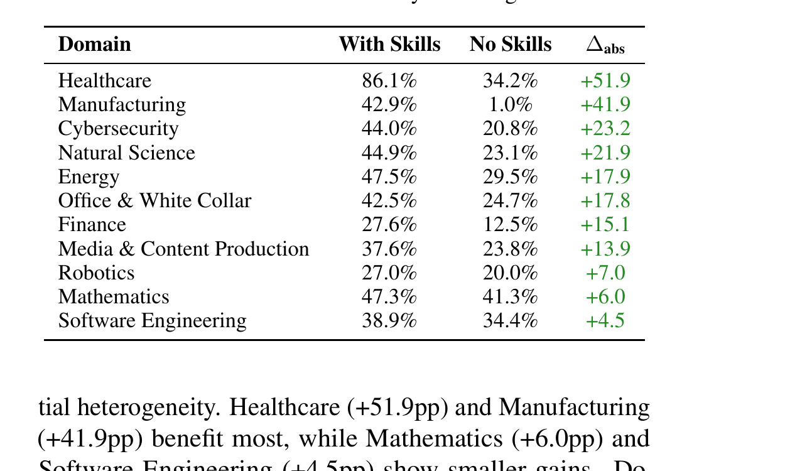

# Healthcare Agents Need Skills, Not Just Models

*Curated skills lift healthcare agent pass rates from 34% to 86%. BioMCP ships one — optimized for 30+ biomedical sources across 12 entity types.*



AI agents are good at reasoning. They're bad at biomedical data.

Ask an agent to investigate BRAF V600E across ClinVar, CIViC, ClinicalTrials.gov, PubMed, and OpenFDA, and it will try to write API client code for each source — different authentication, different identifiers, different rate limits, different output formats. The code is fragile. The context window fills up with HTTP plumbing instead of results. And the agent still misses sources it doesn't know about.

This isn't a model problem. It's a knowledge and infrastructure problem. The agent needs two things it doesn't have: **domain expertise** to know what to look for and where, and **purpose-built tooling** to get it efficiently.

[SkillsBench](https://arxiv.org/abs/2602.12670) (Li et al., March 2026) just put numbers on this. Across 84 tasks in 11 domains, healthcare showed the largest improvement from curated skills of any domain tested: **+51.9 percentage points**, from 34.2% to 86.1% pass rate.


*Table 4 from Li et al., 2026. Healthcare shows the largest absolute improvement of any domain.*

> "Domains requiring specialized procedural knowledge that is underrepresented in model pretraining show the largest improvements, whereas domains with strong pretraining coverage benefit less from external procedural guidance."
> — Li et al., SkillsBench, 2026

Software engineering, where models already have deep pretraining coverage, gained only +4.5pp. Healthcare gained +51.9pp. The gap tells you exactly how much domain knowledge matters.

## The skill codifies expertise. The tool makes it fast.

BioMCP is a single Rust binary that federates 30+ biomedical data sources — ClinVar, MyVariant, PubMed, ClinicalTrials.gov, OpenFDA, UniProt, Reactome, DrugBank, PharmGKB, Monarch, and more — through one unified interface. Parallel API fan-out, built-in caching, retries, rate limiting, and compact output that keeps the agent's context window tight. The agent never writes API code.

But a fast tool without domain knowledge is just a fast way to get lost.

BioMCP ships an embedded skill — a `SKILL.md` with procedural guidance that teaches agents how to actually do biomedical work. Not what the APIs return, but *how to investigate* a variant, *how to profile* a drug's safety, *how to trace* a resistance mechanism across genes, drugs, trials, and literature.

The skill covers all 12 entity types:

| Entity | What agents can do | Sources |
|--------|-------------------|---------|
| Gene | Function, pathways, druggability, disease associations | MyGene, Enrichr, OpenTargets |
| Variant | Pathogenicity, clinical evidence, population frequency, trial matching | ClinVar, CIViC, OncoKB, MyVariant |
| Trial | Search by condition, mutation, drug, status, location | ClinicalTrials.gov, NCI CTS |
| Drug | Labels, interactions, adverse events, approvals, targets | DrugBank, ChEMBL, OpenFDA |
| Article | Literature search, citation graphs, full text | PubMed, Semantic Scholar, Europe PMC |
| Disease | Ontology, gene associations, phenotype matching | Monarch, MyDisease, OpenTargets |
| Pathway | Enrichment analysis, pathway membership | Reactome, g:Profiler |
| Protein | Structure, function, interactions, domains | UniProt, STRING, InterPro |
| Adverse Event | FAERS surveillance data, signal detection | OpenFDA |
| PGx | Pharmacogenomic dosing guidance | CPIC, PharmGKB |
| GWAS | Genome-wide association signals | GWAS Catalog |
| Phenotype | HPO-based phenotype matching | Monarch |

One grammar — `search` to find, `get` to retrieve detail, helpers to pivot between entities — works the same across all of them. The skill teaches the agent this grammar and four deterministic workflows that chain these entities together:

```bash
# Variant pathogenicity — 4 commands, 7 sources
biomcp get variant "BRAF V600E" clinvar predictions population
biomcp get variant "BRAF V600E" civic cgi
biomcp variant trials "BRAF V600E"
biomcp variant articles "BRAF V600E"

# Drug safety — 2 commands, complete safety profile
biomcp get drug pembrolizumab label interactions approvals
biomcp drug adverse-events pembrolizumab
```

Each workflow is a procedure the agent can apply to *any* variant, drug, gene, or disease. The skill doesn't give answers — it teaches the agent how to find them.

## Why skills can't be self-generated

SkillsBench tested what happens when you ask agents to generate their own procedural knowledge before solving tasks. Performance dropped by -1.3pp.

> "This contrasts sharply with curated Skills (+16.2pp), demonstrating that effective Skills require human-curated domain expertise that models cannot reliably self-generate."
> — Li et al., SkillsBench, 2026

The failure modes are predictable. An agent asked to investigate a variant will try general-purpose approaches — "use pandas to parse the ClinVar API" — instead of knowing that BioMCP can retrieve ClinVar annotations, population frequency, CIViC evidence, and clinical trials in four commands. The domain expertise has to come from someone who knows the domain.

As Anthropic's [Agent Skills Best Practices](https://claude.com/blog/equipping-agents-for-the-real-world-with-agent-skills) guide puts it:

> "Skills extend Claude's capabilities by packaging your expertise into composable resources."
> — Anthropic, *Equipping Agents for the Real World with Agent Skills*

BioMCP's skill packages 14 years of clinical genomics experience at GenomOncology into 330 lines of procedural guidance. The agent doesn't need to understand the biomedical data landscape — it just follows the procedures.

## Focused skills beat comprehensive documentation

SkillsBench found that focused skills with 2-3 modules outperform exhaustive documentation:

> "Detailed (+18.8pp) and compact (+17.1pp) Skills provide the largest benefit, while comprehensive Skills actually hurt performance (-2.9pp)."
> — Li et al., SkillsBench, 2026

BioMCP's skill is focused: four workflows, one grammar, supporting files loaded only when needed. Anthropic recommends the same progressive disclosure pattern:

> "The amount of context that can be bundled into a skill is effectively unbounded."
> — Anthropic, *Equipping Agents for the Real World with Agent Skills*

Keep the core tight — teach the procedure. Put the reference material (schemas, examples, jq one-liners) in supporting files that agents pull in only when they need them.

## Smaller models + skills beat larger models without

One more SkillsBench finding that matters for cost:

> "Claude Haiku 4.5 with Skills (27.7%) outperforms Haiku without Skills (11.0%) by +16.7pp. Meanwhile, Claude Opus 4.5 without Skills achieves 22.0%."
> — Li et al., SkillsBench, 2026

A smaller, cheaper model with the right procedural guidance outperforms a larger model running blind. For healthcare agents that need to run hundreds of queries across patients or studies, the cost difference compounds fast. And because BioMCP keeps output compact — the agent gets structured results, not raw API dumps — even small-context models can work effectively.

## Try it

```bash
uv tool install biomcp-cli
biomcp skill install
```

BioMCP auto-detects your agent — Claude Code, Codex, Gemini CLI, Pi, Cursor, Copilot — and installs the skill to the right directory.

Two commands. Thirty sources. Twelve entity types. The domain expertise to use them.

---

**References:**

- SkillsBench paper: [Li et al., "SkillsBench: Evaluating the Effect of Skills on Agent Task Performance," arXiv:2602.12670, March 2026](https://arxiv.org/abs/2602.12670)
- Anthropic: [Equipping Agents for the Real World with Agent Skills](https://claude.com/blog/equipping-agents-for-the-real-world-with-agent-skills)
- BioMCP: [github.com/genomoncology/biomcp](https://github.com/genomoncology/biomcp) | [biomcp.org](https://biomcp.org)
