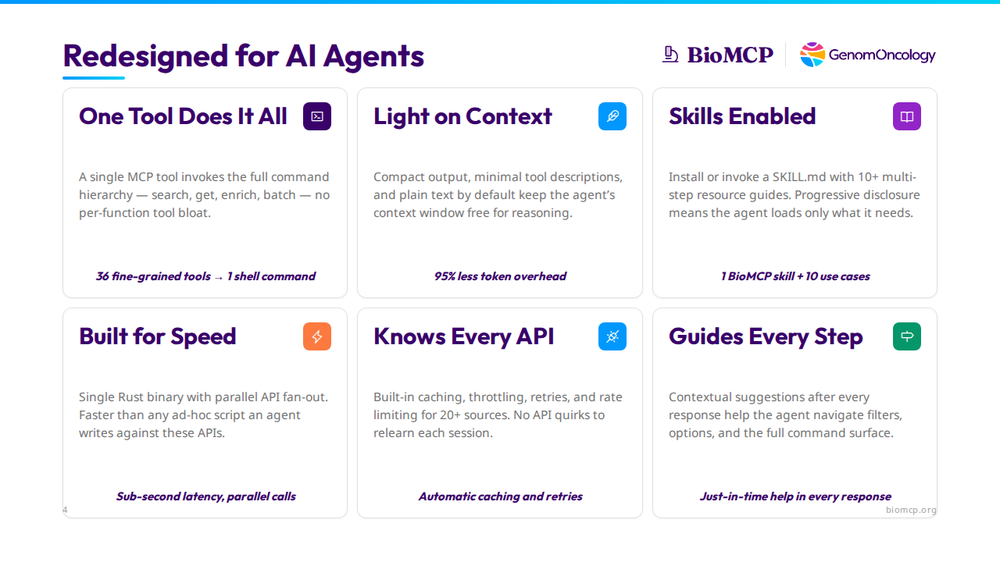

# We Deleted 35 Tools and Our Agent Got Better

*What rebuilding a biomedical data tool taught us about designing for AI agents.*

**TL;DR:** We replaced 36 MCP tools with one CLI command and cut context window overhead by 95%. The agent got faster, cheaper, and more accurate. Here's what we changed and what's generalizable.



---

## The Landscape Shifted

We built the first version of BioMCP in spring 2025. Sonnet 3.7 was the best model you could get. Claude Code had just shipped as a beta nobody was using. The Model Context Protocol had been announced a few months earlier and we were all still figuring out what to do with it. Skills didn't exist. Most open-source models needed hand-holding through every tool call.

A year later, the conversation has changed. Peter Steinberger — creator of [OpenClaw](https://github.com/anthropics/openclaw), now the most-starred project in GitHub history — put it bluntly on [Lex Fridman's podcast](https://lexfridman.com/peter-steinberger/): *"Every MCP would be better as a CLI."* Mario Zechner, creator of [Pi](https://github.com/badlogic/pi-mono) (the coding agent OpenClaw builds on), wrote [an entire post](https://mariozechner.at/posts/2025-11-02-what-if-you-dont-need-mcp/) making the case — his browser tools README is 225 tokens; the equivalent MCP servers consume 13,000–18,000.

They're not wrong. We learned the same lesson the hard way.

---

## The Problem

BioMCP connects AI agents to 20+ biomedical databases — PubMed, ClinVar, ClinicalTrials.gov, gnomAD, OpenFDA, and more — covering 12 entity types from genes and variants to clinical trials and adverse events. The original Python version worked, but it was fighting the agent at every turn.

**36 tools ate the context window.** Every MCP connection loaded all tool descriptions — `article_searcher`, `trial_getter`, `variant_searcher`, and 33 more — consuming ~16,600 tokens before a single query. That's 8% of a 200K context window gone on tool signatures alone.

**Mandatory scaffolding wasted round-trips.** A `think` tool forced a planning step before every real query. Reasonable for spring 2025 models that genuinely reasoned better when forced to plan. Unnecessary for today's models, which plan internally.

**Verbose output burned tokens on formatting.** A trial search that should cost 400 tokens cost 1,600 — indented blocks, nested labels, metadata nobody needed. Multiply by a dozen queries per session.

The Python version was built for early-2025 models. Those models improved faster than our scaffolding, and the scaffolding became the bottleneck.

Here's what changed: models went from needing a forced planning step to planning internally. They went from struggling with 36 tool signatures to handling a single command grammar natively. The `think` tool that helped Sonnet 3.7 reason? It just wastes a round-trip for Opus. The 36 tool descriptions that taught the agent what was available? They eat 8% of the context window before a single query runs. The scaffolding that once *helped* the model now *hurts* it — and the model can't tell you that, it just quietly gets slower and more expensive.

---

### Where it compounds

A single lookup is a clean comparison, but the real payoff is multi-step. A researcher asks: *"What's the clinical significance of BRAF V600E and what are the treatment options?"*

**Old version:** `think` → `variant_searcher` → `variant_getter` → `trial_searcher` → `trial_getter` → `drug_searcher`. Six tool calls, five round-trips, ~6,000 tokens of output. The agent spends most of its context window on formatting, not reasoning.

**New version:** The agent runs `get variant "BRAF V600E"`, sees the contextual suggestion `variant trials "BRAF V600E"`, follows it, then runs `get drug vemurafenib`. Three commands, three round-trips, ~1,100 tokens of output. Each response tells the agent where to go next. The savings aren't additive — they compound with every step.

---

## What We Changed

### 1. One tool does it all

The old version was an MCP server that happened to have a CLI. The new version is a CLI that happens to serve MCP — one tool called `shell` that proxies the full command hierarchy:

```
## Patterns
- `search <entity> [query|filters]` - find entities
- `get <entity> <id> [section...]` - fetch by identifier
- `batch <entity> <id1,id2,...>` - parallel gets
- `enrich <GENE1,GENE2,...>` - gene-set enrichment

## Helpers
- `variant trials <id>`
- `gene articles <symbol>`
- `drug adverse-events <name>`
```

The tool description is auto-generated from CLI help at build time, so it **can never drift** from reality. Context cost: ~800 tokens. Down from 16,600.

We still support MCP — local stdio and remote server modes — but the MCP server is now a thin proxy over the CLI. You don't have to choose. Build the CLI first, serve it over MCP second.

*The general principle: Don't shatter a natural grammar into individual function signatures. Today's models handle a single tool with a command grammar — and you save thousands of context tokens.*

### 2. Light on context

The old version returned everything for every query in verbose indented blocks. The new version is deliberately minimal: compact tables instead of nested labels, plain text by default, and named sections so the agent pays only for the depth it needs.

```
biomcp get gene BRAF              → summary card (~200 tokens)
biomcp get gene BRAF pathways     → + Reactome pathways
biomcp get gene BRAF civic        → + CIViC evidence
biomcp get gene BRAF all          → everything (~2,000 tokens)
```

Every command also supports `--json` for agents that parse structured data. Same data, two formats, every command. The goal is simple: keep the agent's context window free for reasoning, not formatting ceremony.

*The general principle: Return less by default, let the agent ask for more. Agents are good at iterating; they're bad at filtering 5,000 tokens down to the 200 that matter.*

### 3. Skills enabled

Some questions need 4-6 commands across different entities — "What's the clinical significance of this variant and what are the treatment options?" BioMCP ships a single SKILL.md with 10+ multi-step investigation guides, exposed as MCP resources for agent discovery:

```
01  variant-to-treatment    Variant → ClinVar → CIViC → Trials → Drugs
04  rare-disease            Phenotype → Disease → Gene → Variant → Trial
08  drug-safety-review      Drug → FAERS → Labels → Recalls → Interactions
```

The agent reads the skill once and executes the workflow. Progressive disclosure means these resources only get loaded when the agent needs them — if the agent isn't using BioMCP for a given task, it doesn't pay the context cost. You get the best of both worlds: a highly efficient tool with guided workflows that only get recruited when needed.

*The general principle: Design your tool description as carefully as your API. For agents, the tool description is the interface — it's the only thing the model reads before deciding how to use your tool. Auto-generate it from source if you can, so it never drifts.*

### 4. Built for speed

The rewrite to Rust wasn't about language preference. Agent sessions are interactive — the human is watching. A 2-second API call feels instantaneous. A 10-second one feels broken.

A single Rust binary with async parallel API fan-out means a `search all` that hits 8 APIs completes in the time of the slowest single call, not the sum. No runtime, no virtual environment, no dependency conflicts — install and first query in under 60 seconds:

```bash
curl -fsSL https://biomcp.org/install.sh | bash
```

Claude Desktop config is three lines of JSON. Faster than any ad-hoc Python or TypeScript script an agent could write against these same APIs.

*The general principle: Every dependency is a support ticket. Every configuration step is a user who gives up. If the agent's human can't get your tool running in 60 seconds, they'll use something else.*

### 5. Knows every API

BioMCP talks to 20+ biomedical APIs, each with their own quirks — rate limits, pagination schemes, authentication patterns, response formats. The agent shouldn't have to relearn any of this.

Built-in 24-hour disk cache means repeat queries are instant. Per-source rate limiting with token-bucket throttling ensures the agent never sees a 429. Automatic retries handle transient failures transparently. The agent never knows rate limits, retries, or caching exist — it just gets fast, reliable responses every time.

*The general principle: Handle infrastructure transparently. If you let a 429 bubble up, the agent will waste tokens reasoning about retry logic instead of doing its job.*

### 6. Guides every step

Every command output ends with contextual suggestions — not generic help, but specific next steps based on what the current response contains:

```
Use `get variant <id>` for details.
Use `variant trials "BRAF V600E"` for recruiting trials.
Filters: -g <gene>, --significance <value>, --max-frequency <0-1>
```

The agent doesn't memorize the command surface. Each response teaches it where to go next — which filters are available, which cross-entity helpers apply, what deeper sections exist. Contextual suggestions after every response help the agent navigate filters, options, and the full command surface.

*The general principle: End each response with contextual follow-up actions. The agent shouldn't re-read the tool description to figure out its next move. This is especially high-leverage for tools with large command surfaces.*

---

## Results

| Metric | Python (v0.7) | Rust (v0.8+) | Change |
|---|---|---|---|
| Tool descriptions loaded | 36 tools, ~16,600 tokens | 1 tool, ~800 tokens | **95% reduction** |
| Variant lookup output | ~1,400 tokens | ~350 tokens | **75% reduction** |
| Trial search output | ~1,600 tokens | ~400 tokens | **75% reduction** |
| Round-trips per query | 3-4 (think + search + get) | 1 | **70% fewer** |
| Median entity lookup | 2-5 seconds | 500ms-1s | **4-5x faster** |
| Install requirements | Python + pip + 12 deps | Single binary | **Zero deps** |
| MCP config | pip install + venv + JSON | 3 lines of JSON | **60 seconds** |

### Accuracy improved too

Fewer tokens isn't just cheaper — it leaves room for the model to reason. We validated BioMCP against 7 published biomedical papers, checking every factual claim the agent made against source databases. The result: 90% accuracy score with zero hallucinations. Every fact traced back to ClinVar, ClinicalTrials.gov, or another primary source. When the agent has context to spare, it reasons better — it cross-references instead of summarizing, it catches inconsistencies instead of glossing over them.

---

## The Checklist

If you're building tools for AI agents — in biomedicine or anywhere else — here's what we learned:

1. **One tool, not many.** Don't shatter a natural grammar into individual function signatures. Models handle a command hierarchy; save thousands of context tokens.
2. **Return less by default.** Let the agent ask for more. Agents are good at iterating; they're bad at filtering 5,000 tokens down to the 200 that matter.
3. **Design the tool description like an API.** It's the only thing the model reads before deciding how to use your tool. Auto-generate it from source so it never drifts.
4. **Every dependency is a support ticket.** If the agent's human can't get your tool running in 60 seconds, they'll use something else.
5. **Handle infrastructure transparently.** If you let a 429 bubble up, the agent will waste tokens reasoning about retry logic instead of doing its job.
6. **End each response with next steps.** The agent shouldn't re-read the tool description to figure out its next move.

The common thread: **get out of the model's way.** The scaffolding that helped last year's models is the bottleneck for this year's.

---

## Try It

Install BioMCP and run your first query in under a minute:

```bash
curl -fsSL https://biomcp.org/install.sh | bash
biomcp get variant "BRAF V600E"
```

Or connect it to Claude Desktop:

```json
{
  "mcpServers": {
    "biomcp": { "command": "biomcp", "args": ["serve"] }
  }
}
```

Then ask: *"What's the clinical significance of BRAF V600E and are there recruiting trials near Cleveland?"*

BioMCP is open source and MIT licensed — [github.com/genomoncology/biomcp](https://github.com/genomoncology/biomcp)
