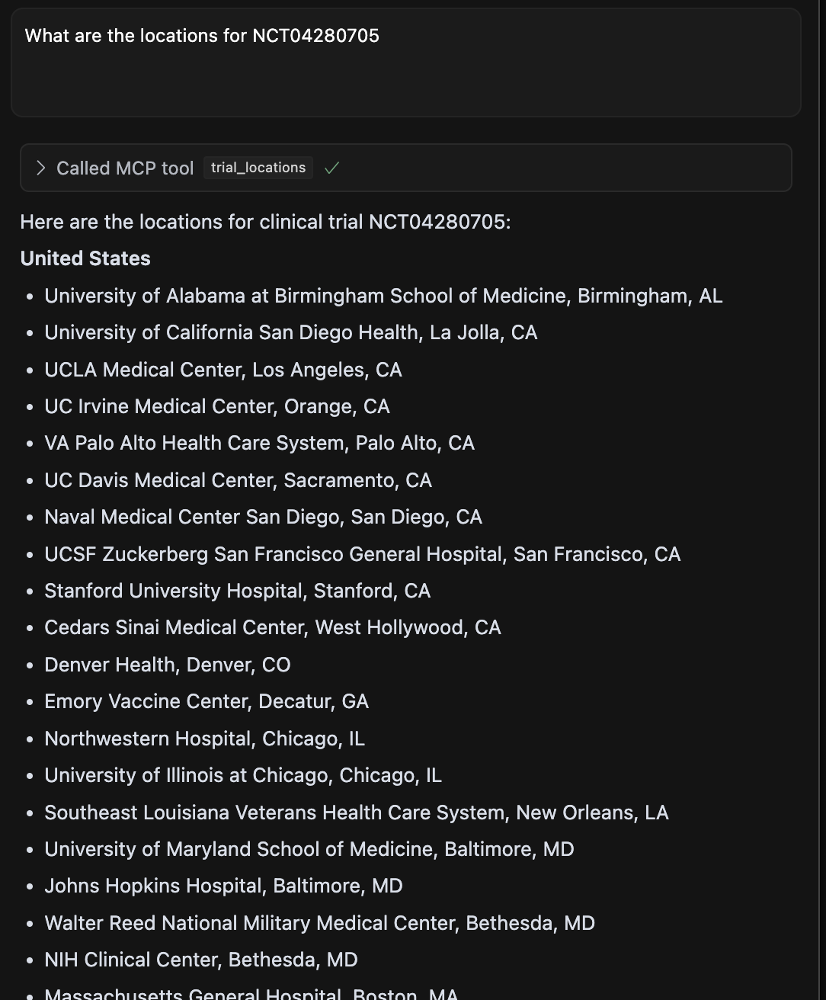

# BioMCP with Cursor IDE: Step-by-Step Tutorial

This tutorial will guide you through setting up BioMCP within the Cursor IDE, allowing you to access specialized biomedical data directly from your development environment.

## Prerequisites

- [Cursor IDE](https://www.cursor.com/en): Download and install from the official website
- A Smithery account with an active token

## Installation Steps

1. Download and install Cursor IDE from [https://www.cursor.com/en](https://www.cursor.com/en)

2. Open Cursor IDE and access the terminal (you can use the keyboard shortcut `` Ctrl+` `` or go to Terminal > New Terminal)

3. In the Cursor terminal, run the following command:

   ```bash
   npx -y @smithery/cli@latest install @genomoncology/biomcp --client cursor
   ```

4. You will be prompted to enter your Smithery token, which can be retrieved from your Smithery account

5. Once the installation completes successfully, BioMCP is ready to use within Cursor IDE

## Using BioMCP with Cursor

You can now use BioMCP by asking questions directly in the Cursor IDE. For example, try asking:

- "What are the locations for NCT04280705?"

The response will include detailed information about the clinical trial locations:



## Example Queries

### Clinical Trials Queries

Try questions like:

- "Find Phase 3 clinical trials for lung cancer with immunotherapy"
- "Are there any recruiting breast cancer trials near Boston?"
- "What are the eligibility criteria for trial NCT04280705?"

### PubMed Articles Queries

Try questions like:

- "Summarize recent research on EGFR mutations in lung cancer"
- "Find articles about the relationship between BRAF mutations and melanoma"
- "Get the abstract of PubMed article 21717063"

### Genetic Variants Queries

Try questions like:

- "What's the clinical significance of the BRAF V600E mutation?"
- "Find pathogenic variants in the TP53 gene"
- "Explain the difference between Class I and Class III BRAF mutations"

## Troubleshooting

### Common Issues

- Installation fails:

  - Make sure you have the correct Smithery token
  - Check your internet connection
  - Verify you have the necessary permissions to install packages

- No results returned:
  - Your query may be too specific or use terms not in the databases
  - Try reformulating with more standard medical terminology

## Resources

- [BioMCP Documentation](https://biomcp.org)
- [Cursor IDE Documentation](https://www.cursor.com/en/docs)
- [Smithery Documentation](https://smithery.io/docs)
